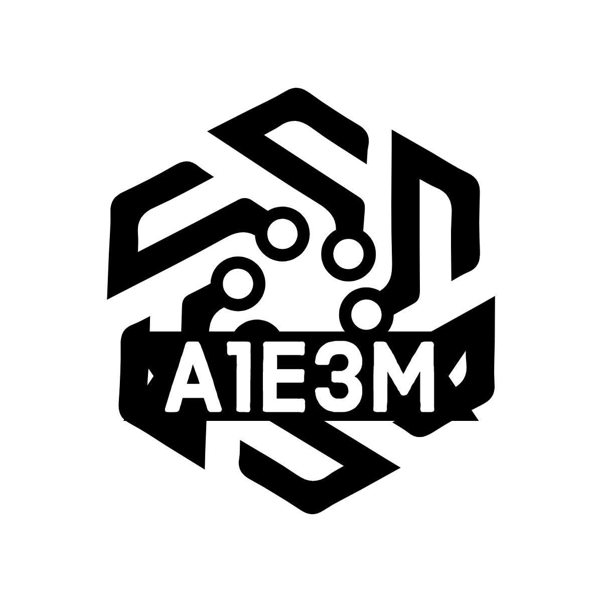

<!--
*** Thanks for checking out the Best-README-Template. If you have a suggestion
*** that would make this better, please fork the repo and create a pull request
*** or simply open an issue with the tag "enhancement".
*** Don't forget to give the project a star!
*** Thanks again! Now go create something AMAZING! :D
-->

<!-- PROJECT LOGO -->
 

  

<h3 align="center">My Portfolio Website</h3>

  

    A website to display everything about me!
     
     
     
  

<!-- CONTACT -->
## Contact

[![LinkedIn][linkedin-shield]][linkedin-url]
[![Facebook][facebook-shield]][facebook-url]
[![Instagram][insta-shield]][insta-url]

<!-- ACKNOWLEDGMENTS -->
## Acknowledgments

* Billy - Website Template

<!-- MARKDOWN LINKS & IMAGES -->
<!-- https://www.markdownguide.org/basic-syntax/#reference-style-links -->
[linkedin-shield]: https://img.shields.io/badge/LinkedIn-0077B5?style=for-the-badge&logo=linkedin&logoColor=white
[linkedin-url]: https://linkedin.com/in/a1e3m
[facebook-shield]: https://img.shields.io/badge/Facebook-1877F2?style=for-the-badge&logo=facebook&logoColor=white
[facebook-url]: https://www.facebook.com/seaboiii/
[insta-shield]: https://img.shields.io/badge/Instagram-E4405F?style=for-the-badge&logo=instagram&logoColor=white
[insta-url]: https://www.instagram.com/a1e3m/

[product-screenshot]: .img/background.jpg
