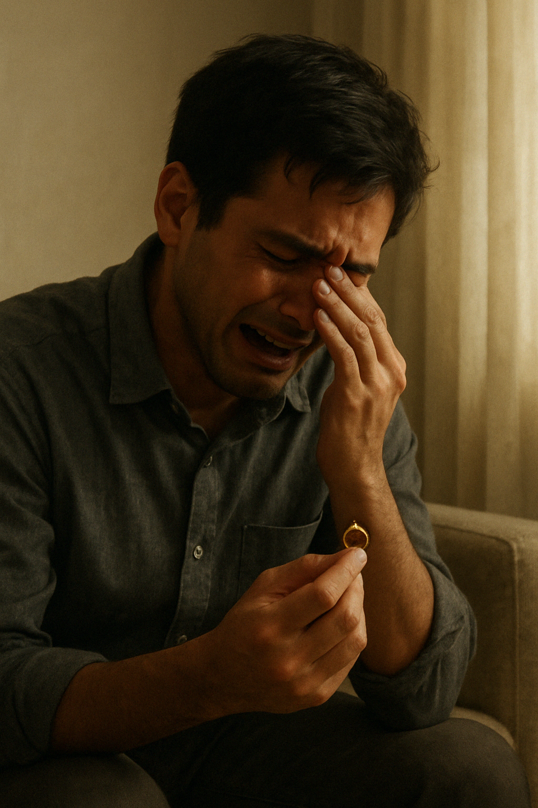

## Chapter 1: The Empty Room  
*As If You Never Left*

The wedding dress was still hanging on the back of the door.  
A soft ivory silk, its hem brushing just above the floor, with tiny glass beads that caught the morning light like dew on petals. It hadn’t moved since the day Raiyan carried it home from the boutique—since Mira’s last fitting, three weeks before the accident.

The room smelled faintly of lavender and something else he couldn’t name. Not perfume exactly, but the scent of skin and sunlight and memory. It clung to the sheets, to the pale blue throw blanket she insisted on keeping even though it didn’t match the room. Her hairbrush sat on the vanity, tangled with strands she’d never comb through again.

Raiyan stood at the threshold. He didn’t cross it.

He had opened the door only twice since the funeral. The first was to turn off the ceiling fan that had been spinning idly for days. The second was today.

The morning light fell through sheer curtains in quiet ribbons, dust floating in the stillness like frozen rain. Her potted jasmine had withered. He should’ve watered it. He couldn’t bring himself to. It felt like disturbing a grave.

He finally stepped in.

His footsteps felt wrong on the carpet, like he was trespassing. Like she might walk in at any moment, scold him gently for stepping in with wet socks, then laugh and kiss his cheek and forgive him anyway.

His eyes drifted to the dressing table—her lipstick still uncapped, a mug of cold, ancient coffee with a lipstick stain. A note she had written to herself was still tucked beneath a jewelry box.

> “Don’t forget to call Mama. Order cake by Friday. Tell Raiyan you love him (again).”

Raiyan sat down at the edge of the bed. The frame creaked in a way he hadn’t heard in weeks.

There were no tears. Not today. Not yet.

He simply stared at the wedding invitation framed on the wall, with their names scripted in gold:  
**Mira Afnan & Raiyan Zain.**  
**Solemnisation: 22nd November.**

It was supposed to be two weeks ago.

He reached into his coat pocket and pulled out her ring. The one she never got to wear. It gleamed in the light like it was still waiting for her.

He stared at the curve of the metal, the tiny engraving inside: *"forever, even in silence."* He had chosen those words. He had imagined whispering them at the altar. Now they sat heavy in his palm, a broken promise sealed in gold.

And then the dam broke.

His shoulders crumpled forward, as though the weight of the ring had finally become too much. He clutched it to his chest and began to sob—quiet at first, as if unsure whether he was allowed. Then came the gasps, the choked shudders, the raw sound of someone who had held it all in for far too long.

Tears soaked into the bedspread. He folded into himself like a child, rocking slightly, whispering her name over and over again. "Mira... Mira, I'm sorry."

He had tried to be strong. To carry on. To convince others—and himself—that he was coping. But now, in this room filled with the echo of her presence, the truth surfaced:

He was devastated. He was heartbroken. And he didn’t know how to live in a world where she no longer existed.

---

He stayed there for an hour. Maybe more. The sun climbed higher, casting sharper shadows across the bedspread. At some point, he lay down, shoes still on, staring at the ceiling fan that no longer moved.

He didn’t know what he was waiting for. Maybe for the silence to answer him. Maybe for the room to breathe again.

But it never did.

And in that stillness, the guilt returned.

He hadn’t been there.

He had been in the office, reviewing blueprints for a project he didn’t care about, when the call came in. A pile-up on the expressway. Mira had been caught in the rain. Her car skidded. They said it was instantaneous. They said she didn’t suffer.

He didn’t believe them.

Every night since, his mind rewound the timeline. What if he had picked her up? What if he’d insisted she stayed home? What if he hadn’t been so distracted by work, so consumed by deadlines and progress and everything that now felt completely meaningless?

“I should’ve been there,” he whispered into the bedsheets.

His voice cracked like dry leaves.

He remembered the last thing they said to each other.

And with it, came the flood of memories—each one sharp, vivid, and aching.

He remembered the night she stayed up making care packages for his site crew, even though she had a fever. She had joked that love was measured in packed sandwiches and cold medicine.

He remembered the time they fought over curtain colors—how she wanted lavender and he preferred grey. She had won, of course. But she let him think it was a compromise.

He remembered the picnic they had in the car during a thunderstorm. How she cupped her hands around his face and said, "Even the rain loves us. It follows us everywhere."

He remembered the first time she held his hand in public. The warmth, the casual boldness. How her thumb brushed over his knuckles like a secret language.

He remembered everything.

And yet, when it had mattered most—he had said nothing.

**“Drive safe.”**  
**“I will. Love you.”**

He hadn’t said it back. He was late for a meeting.

That silence haunted him more than her absence.

It was a silence that echoed through every hour of every day. A silence that wrapped around him in the mornings, when he reached for his phone out of habit, expecting her good morning message. A silence that screamed at him across the dinner table, where her plate still sat untouched. It followed him through hallways, into the car, even in meetings where he tried to fake a smile.

It wasn’t just that she was gone.

It was that the last thing she heard from him was nothing.

He had meant to say it. He always did. But that day—he had been distracted. Preoccupied with a delay on site, a client’s complaint, an unread report. He had ended the call too quickly. 

And now, that silence was etched into his bones.

He wondered if she waited for it, those last moments in the rain. If she remembered that he hadn’t said it back. If she closed her eyes and thought, just for a second, that maybe he had stopped loving her.

He buried his face into the sheets, trying to breathe through the tightness in his chest.

He would’ve given anything to take it back.

To have just one more moment—not to change the outcome, not to beg fate for mercy—but simply to say the words he never did.

*"I love you, Mira. I always did."*

---

Later that afternoon, he stood in front of the bookstore.  
**Mira’s Book Garden**, the tiny corner shop they used to frequent, tucked between a bakery and a reflexology place. The owner had once joked that they were the only couple who could turn a poetry aisle into a date spot.

He hadn't gone inside since she passed.

But today, a sudden pull brought him there. Not planned. Just… instinct. As if something had brushed past his ribs and whispered: _“Go.”_

The bell above the door chimed when he stepped in. Familiar scent—old paper, pinewood shelves, and the vanilla undertone of the cookies Mira always snuck in.

And then he saw her.

A woman in a soft cream blouse, back turned, fingers running along the poetry shelf. She pulled out a collection of Rumi—the same one he’d bought for Mira when they first started dating.

Something in the curve of her neck. The way she tilted her head. His heart stilled.

“...Mira?”

The woman froze.

She turned slowly.

Same eyes. Same face.

But not her.

Not quite.

Raiyan didn't notice the difference. Grief had blurred the lines between memory and reality. He stepped forward with trembling hope, already filling in the cracks with longing. In that moment, reason was irrelevant. All he saw was the one he had lost.

And she was standing right there.

Not a ghost. Not a memory. Not a hallucination crafted by his grief.

He didn’t question how. He couldn’t. Not yet.

His heart beat so loudly he thought the woman might hear it. Everything else—time, logic, caution—faded beneath the desperate need to believe.

He took a step closer, and she blinked, startled by the rawness in his eyes. Her lips parted, as if about to speak, but no words came.

Raiyan, overwhelmed and trembling, whispered again—softer this time, almost afraid to break whatever fragile dream this might be:

"Mira...?"

And as the silence stretched between them, the world held its breath.

