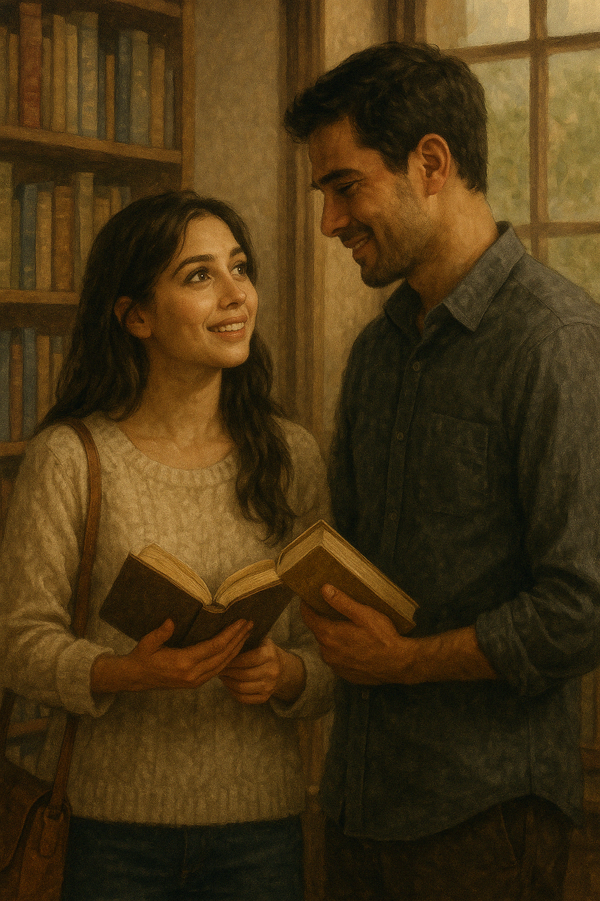

## Chapter 2: The Woman in the Rain  
*As If You Never Left*

Rain had begun to fall again. Gentle, steady, like a memory revisiting the city. It beaded against the glass window of the bookstore, blurring the outside world into abstract watercolors of grey and green.

Elara Lin stood frozen, the book still in her hand.

She didn’t know this man. And yet, when he said that name—Mira—something deep inside her tightened.

He looked at her as if the earth had cracked open and given him back the sun.

His eyes searched her face with a desperation that almost made her speak. Almost. But she didn’t. She couldn’t. Because for a moment—a terrifying, impossible moment—she had looked into his face and felt something too.

Not recognition.

Not memory.

But ache.

Elara slowly placed the book back onto the shelf. Her hands trembled. She had been here before. Not this place, not this body. But this moment—of being seen, of being wanted, of not knowing who she was meant to be.

She turned, her voice quiet. "I… I'm sorry. I think you've mistaken me for someone else."

Raiyan flinched as though struck.

But even then, he didn’t let go of her with his eyes. "No. You're… you're Mira."

Elara’s throat tightened.

That name again.

She had begun to fear that name. Not because it was unfamiliar, but because it was becoming too familiar. Mira. The syllables followed her everywhere. Echoed in hospital corridors, wrapped around hushed conversations, painted into photo frames she didn’t recognize.

At first, she resisted. She told them her name. She insisted this was a mistake. But her own voice sounded foreign. And their eyes—so full of love, hope, and disbelief—left her too ashamed to keep arguing.

She started to wonder: Was it easier to pretend? Or had she already begun to forget who she really was?

Some days, she looked into the mirror and searched for Elara. The florist. The girl who had once spilled coffee on her favorite bouquet. The one who used to hum Chopin while trimming lavender.

But the reflection only blinked back with Mira’s eyes.

Now here was Raiyan, standing inches away, saying that name with a kind of reverence that made her heart twist.

What would it mean to say, "I'm not her"?

Would it break him?

Would it break herself?

In the weeks since she had awakened in this unfamiliar body, everyone had called her that. Doctors, nurses, a tearful grandmother. She had awoken in a hospital room surrounded by strangers, all speaking as if she had returned from the dead.

She didn’t understand it.

All she remembered was the weightlessness. The feeling of letting go. The cold. And then—a heartbeat. A breath that wasn’t supposed to be hers.

And now, this man. This man who looked at her like a prayer finally answered.

He took another step forward. "Mira… it’s me. It’s Raiyan."

Elara didn’t step back. She didn’t move at all. But inside, the ground trembled.

She could have told him. Could have confessed right then that she wasn’t who he thought she was. That her name was Elara. That she didn’t know how or why this was happening.

But when she opened her mouth, the words didn’t come.

Because deep down, a part of her wasn’t sure if they would believe her. Or if she even believed it herself anymore.

So instead, she did the only thing she could.

She smiled. Weakly. Sadly. And whispered, "Hi, Raiyan."

Outside, the rain fell heavier.

And inside, time began again.

He stepped closer, cautiously—as if she might vanish should he move too quickly. She could feel the warmth of him now, and beneath that, the sorrow. It radiated off him like steam from pavement after a storm.

"I missed you," he said, barely louder than a breath.

Elara's heart stuttered. Not because she believed him. But because the ache in his voice made her wish she were someone else—someone who could shoulder the weight of those words.

She wanted to tell him that she missed someone too. A life. A self. But those thoughts were fleeting, scattered like petals in the wind.

He reached out, slowly, as if asking permission with the motion alone. His fingers brushed hers—barely—and she didn’t flinch. But neither did she move.

The moment stretched, aching and fragile.

“I… I don’t remember much,” she said, unsure whose truth she was trying to protect—his or hers.

Raiyan gave the softest nod. “It’s okay. You’re here. That’s enough.”

And just like that, Elara felt something close within her. A door she hadn’t meant to open. A life she hadn’t meant to step into.

But now, the rain was falling, and he was looking at her with eyes full of old love.

And she… she didn’t have the heart to turn away.

They stood there, suspended in the quiet hum of the rain and the soft ticking of the shop’s old wall clock. Around them, rows of books watched like silent witnesses—stories shelved neatly while theirs was just beginning, or perhaps, beginning again.

Raiyan stepped toward the counter and gestured to a small reading nook near the back. “Do you want to sit?” he asked gently, the way one might ask a ghost if it remembered how to breathe.

Elara nodded, not because she was ready, but because her legs were trembling.

They settled into the two worn armchairs by the window. The same chairs Mira had once curled into while reading poetry aloud. The cushion gave way beneath her like it remembered her weight, and for a flicker of a second, Elara felt dizzy.

Raiyan sat across from her, hands clasped between his knees. He kept stealing glances at her, as if afraid she might dissolve into mist.

"You used to love coming here," he murmured. "Every Friday after lunch, remember? You’d head straight for the poetry shelf and lose track of time. I had to bribe you out with iced coffee."

Elara gave a faint smile. "Sounds like someone I'd want to be."

He laughed softly. The sound was rough, unused. "You still are. Even if it’s... taking time."

She looked away, unsure what to do with his tenderness.

Outside, a child ran past the storefront holding a bright red umbrella. Elara followed it with her eyes, longing for its clarity, its direction. But her world was fog, and the man in front of her was holding a map she didn’t know how to read.

He leaned forward. "Do you want to go somewhere? Get some air? We don’t have to talk. I just... I want to be where you are."

And again, she found herself nodding. Not because she understood—but because something in his sorrow made her want to try.

Raiyan rose slowly, offering her his hand. She hesitated before taking it, her fingers slipping into his palm like a question without an answer. The warmth of his touch grounded her in a body she still wasn’t sure was hers.

They stepped outside, the rain now light enough to walk beneath. He held his umbrella above them, shielding her without a word. The sidewalk shimmered with reflections—streetlights stretched into golden smears, puddles blinking like forgotten memories.

Neither of them spoke as they walked. The silence between them wasn’t uncomfortable. It was delicate. Protective. Elara felt it wrap around her like a borrowed coat, still scented with lavender and grief.

He led her to a quiet park nearby, where the benches were slick with rain and the leaves whispered low secrets to the wind. They sat side by side, close but not touching.

She watched a drop of water slide from a leaf, landing soundlessly onto the stone path below.

"Do you believe in second chances?" she asked, her voice barely a ripple.

Raiyan turned to her, his gaze gentle. "I never used to."

He looked at her as if trying to memorize every blink, every breath.

"But right now," he said, "I think I might."

Elara looked away, her gaze drifting to the darkened silhouettes of the trees. The wind tugged at her sleeves. Her borrowed body. Her borrowed time.

"Do you think it's possible to start over," she said, "even if you don't remember how the first story ended?"

Raiyan was quiet for a moment. Then, "Maybe it doesn’t matter how it ended. Maybe it only matters that you’re still here. That we have a page left to write."

She smiled, but it was the kind that only curled at the edges, never reaching her eyes. Inside, her chest ached—not from sorrow, but from the weight of being wanted for someone she wasn’t.

A part of her wished she could tell him. Everything. The truth, raw and ugly and impossible. That she was not the woman he loved. That she didn’t know if she ever could be. But another part—quieter, more fragile—wanted to hold this moment a little longer. 

Even if it wasn’t hers to hold.

So she said nothing. Just listened to the rain. To the breath between them. To the silence that, somehow, no longer felt empty.

A breeze stirred, carrying the faint scent of wet earth and distant blossoms. Elara tilted her head back, letting the cold mist touch her face. It reminded her that she was real. That this moment, no matter how impossible, was hers to experience.

Raiyan sat quietly beside her, his presence steady. Not demanding. Not pressing. Just... there. And perhaps that was what made it all the more painful. He wasn’t trying to convince her of anything. He was simply loving who he thought she was.

She turned slightly, studying the profile of the man who had been Mira’s everything. The quiet strength in his jaw, the weariness around his eyes, the subtle way his thumb brushed against his knee—like a ritual, perhaps a grounding habit he’d developed after losing her.

“You’re different,” he said suddenly, his voice so soft she nearly missed it. “Not in a bad way. Just... softer, maybe. Quieter. Like you’re still coming back to yourself.”

Elara blinked.

Was that what he saw? A version of Mira waking slowly from grief? Or did he, in some quiet corner of his soul, suspect the truth?

She didn’t know. And it frightened her that she was beginning not to want him to know.

The rain began again—gentle, persistent. And this time, they didn’t move. They let it fall.

Elara closed her eyes, letting the sound fill her.

Just for now, she thought.

Just a little longer.

She wondered what Mira had loved most about him.

Was it his quiet strength? The way he spoke as though words should be measured, not wasted? Or maybe the way he looked at people—not just at their faces, but into them, as though searching for the things they were too afraid to say.

Elara didn’t know him, not really. But something about sitting there, shoulder to shoulder, felt like a page half-turned—an unfinished sentence. A breath that hadn’t yet been released.

He shifted slightly, resting one arm along the back of the bench, his fingers grazing the wood near her shoulder. Not touching her. Just near. Like a lighthouse might stand near the shore—not to hold the sea, but to offer direction.

“You used to say the rain was romantic,” he murmured, not quite looking at her.

Elara swallowed. “Maybe it still is.”

He turned then, his eyes scanning her expression as if trying to match it to the woman he remembered. “You don’t have to be her all at once,” he said quietly.

Elara’s breath caught.

She didn’t know whether to feel seen or exposed.

“Just be here,” he added, more gently. “That’s all I need.”

Her fingers tightened slightly around the edge of the bench. Her heart wanted to run. But her soul stayed seated.

So she nodded.

And in the stillness between raindrops, Elara allowed herself the smallest thing:

To be held, not by arms, but by the fragile grace of being wanted, just as she was—in a life that was not hers, in a moment that might never come again.

A single streetlamp buzzed on behind them, its warm glow spilling onto the wet pavement like a quiet promise. Somewhere nearby, a cat meowed beneath a parked car, and the distant hum of traffic reminded her that the world continued turning, even when hers had been paused and borrowed.

Raiyan broke the silence. “There was a poem you used to love.”

Elara turned her head slightly, unsure how to respond.

He smiled faintly, gaze distant. “You made me memorise it. You’d recite it while waiting for coffee to brew. I used to tease you that you loved Rumi more than me.”

He chuckled softly, then his voice dropped to a whisper. “
*Don’t grieve. Anything you lose comes round in another form.*”

The words pierced through her like a whisper from somewhere else, somewhere beyond both of them.

Elara looked down at her lap, blinking rapidly. “It’s beautiful.”

“You said it meant that love never dies,” Raiyan said. “It just… changes shape.”

She bit the inside of her cheek.

If only he knew how much it had changed.

If only she knew what shape her love was meant to take—if she was even allowed to love in this life, in this borrowed skin.

The streetlamp flickered once, then held steady. The night deepened, quiet and golden.

And for a while longer, they just sat. No past. No future. Just the fragile, trembling now.

Eventually, Raiyan stood, brushing rain from his coat. “Come,” he said, offering her a hand once more. “Let’s get you home.”

Elara hesitated for a heartbeat. Then placed her hand in his.

They walked through the soft hush of the evening, past shuttered cafés and closed storefronts, beneath trees dripping with silver droplets. He didn’t ask her questions. She didn’t offer any truths. And yet, something unspoken passed between them—a quiet agreement to hold off the weight of reality, if only for tonight.

When they reached the steps of Mira’s apartment—the place that now whispered with Elara’s breath—Raiyan paused. “Will you be okay?”

She nodded, her fingers still damp with rain.

He lingered, eyes searching hers once again. Then, with a reluctant smile, he said, “Goodnight, Mira.”

Elara watched him go, his figure disappearing into the amber-lit distance.

And only when the door closed behind her, did she allow herself to whisper what she couldn’t say aloud.

“My name is Elara.”

But no one was left to hear it.

She leaned her back against the closed door, her breath shaky. The apartment was dark, quiet. Still. As if it too was holding its breath.

The rain tapped against the windows like a persistent thought, and in the silence, the ache returned.

Who was she?

She wandered into the bedroom—Mira’s bedroom—and sat at the edge of the bed, staring at the soft photographs on the nightstand. Smiling faces she didn't know. Letters signed with love. Familiar handwriting. A past that wasn’t hers.

She closed her eyes and waited.

And that night, for the first time since waking in Mira’s body, the memories returned—not Mira’s, but her own.

A florist shop bathed in golden light. A mother humming while arranging lilies. A younger version of herself, laughing beneath strings of dried eucalyptus. The scent of bergamot tea. Her own name, whispered like a promise.

Elara.

The images came fractured, out of order. Emotions without explanation. But they were hers.

And with them came a whisper, one that wasn’t hers either—but that rang with truth: _"You have a hundred days."_

Not to pretend. Not to live a borrowed life.

But to close a story. Or maybe, to rewrite the ending.

