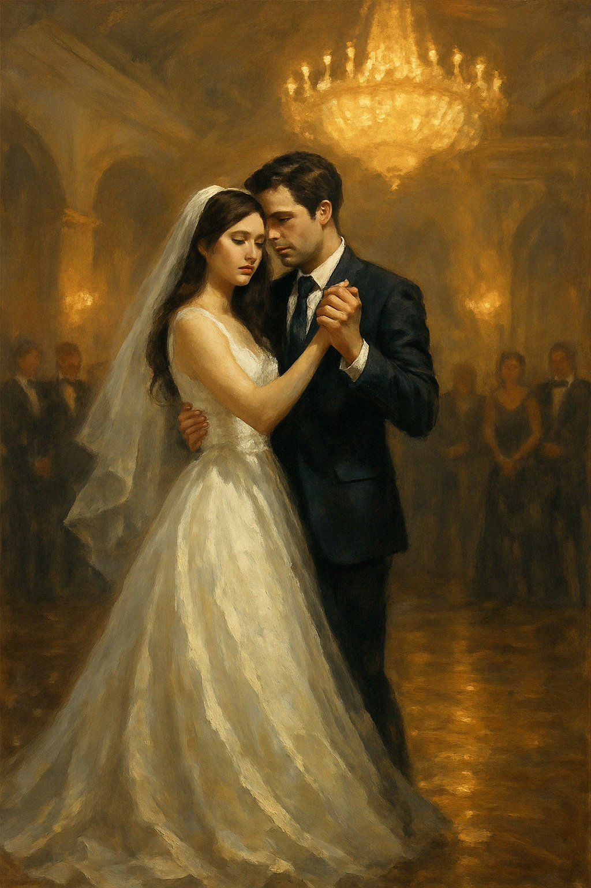

## Chapter 4: A Wedding Never Meant
*As If You Never Left*

The dress hung untouched in the corner of the closet. Ivory silk, delicate as breath.

Raiyan hadn’t spoken of it since the day she returned. But Elara saw the way his gaze sometimes lingered on the closet door, like a man haunted by a promise that never arrived.

One evening, while the world outside quieted beneath soft golden skies, Elara opened the door.

She ran her fingers along the fabric. It felt cool, weightless, like memory.

She didn’t take it out for ceremony.

She took it out for something smaller.

A dance.

One they never had.

And one that, for one night, might allow her to feel what it meant to be loved—not as a ghost or memory—but as a woman alive in the arms of a man who had once lost everything.

She slipped the dress off its hanger and held it against her body, feeling the whisper of silk fall over her shoulders. It was heavier than she imagined, the weight of expectation stitched into every seam. She stepped into it slowly, careful not to disturb the quiet that wrapped itself around the room.

As the zipper closed up her spine, Elara caught her reflection in the mirror. For a moment, she didn’t breathe.

She looked like Mira.

But she also didn’t.

Her hands trembled slightly as she smoothed the fabric down her sides. Her hair had fallen into soft waves that Mira used to wear on special occasions—yet now it framed a different face. The eyes staring back were wide, uncertain, and filled with a sadness that didn’t belong to wedding nights or celebration.

This wasn’t about becoming a bride.

This was about becoming a memory—one she never got to create.

She walked to the center of the room and stood beneath the low light of the chandelier. The dress shimmered faintly, catching hints of gold and dusk as if the fading sun couldn’t quite let go.

And neither could she.

She closed her eyes and let her hands fall to her sides, feeling the fabric cling softly to her shape. A thousand imagined moments bloomed in her mind—moments that Mira might have had. The hush of guests turning as the music began. The hush of Raiyan's breath as he first laid eyes on her. The hush of vows spoken like a sacred truth.

But all of it was imagined. None of it hers.

Still, Elara held the weight of those dreams in her chest, letting herself feel their edges. Not because she wanted to replace Mira, but because she didn’t want Mira’s story to end in silence.

This dress was never meant for her. And yet, tonight, she wore it not for photographs or applause—but for memory. For grief. For love that never got to take its final form.

She lifted her arms slightly, imagining Raiyan’s hand resting at her waist, his other hand cradling hers. There was no music, no rhythm—only the slow heartbeat in her ears and the soft creak of the wooden floor beneath her bare feet.

She began to move. A single step. Then another.

A dance of shadows and ghosts. A dance for a life that was never lived.

Tears slid down her cheeks silently, unnoticed by the room, by the walls, by the dress that swayed with a grace she did not feel. And yet, she kept going.

Because this, too, was a kind of love.

The kind that exists in absence.

The kind that says goodbye while pretending it's a hello.

She didn’t hear the door open.

Didn’t hear Raiyan step inside.

It had been days since he last saw her.

Their conversations had grown quieter, less frequent. He didn’t want to overwhelm her. But tonight, a memory had caught him off guard—a fragment of their old plans, the dress, the song. It stayed with him all evening like something left unsaid.

So he came.

Not to talk. Not even to stay long. Just to return a book she'd left in his car. A small excuse, but enough to knock.

When he reached the door, he noticed it was slightly ajar, as if waiting. He paused, uncertain. Then gently, he pushed it open.

And when he pushed it open—when he saw her standing in the center of the room, barefoot in the wedding dress, arms faintly raised, tears slipping silently down her cheeks—he froze.

The moment caught him like breath underwater.

The sight hit him like a breath he didn’t know he’d been holding for months.

“Mira…?”

His voice broke the stillness.

She turned sharply, startled, her breath catching as if she had been pulled out of a dream. The tears hadn’t stopped. If anything, they shimmered more under the weight of his gaze.

He took a step forward, then another, until he stood just a few feet from her.

“You’re crying,” he said softly.

She tried to smile, to shrug it off, but the gesture crumbled before it reached her lips. “I didn’t mean for you to see this.”

Raiyan shook his head. “But I’m glad I did.”

He stepped closer. Gently. As if any sudden movement might wake her from whatever fragile world she had built around herself.

“I never got to see you in it,” he whispered. “Not like this.”

Elara looked down at the dress, then back up at him, eyes rimmed with sorrow. “It was never mine.”

Raiyan didn’t argue.

He just reached for her hand.

And when she didn’t pull away, he led her into that same slow rhythm she had imagined moments before—this time, not alone.

From the nearby speaker, a soft melody began to hum. Raiyan had unknowingly pressed the old playlist Mira once made. The song that played was gentle, familiar—*Can I Have This Dance*. The room filled with its warmth, with every note falling like petals around them.

He placed his hand lightly on her waist, the other holding her fingers with reverence. She rested her free hand on his shoulder, her breath still shaky, but her steps beginning to steady.

Together, they moved—not with precision, but with grace born of memory and longing. Their bodies swayed gently in time with the music, slow and deliberate. Her bare feet slid over the wood like a whisper. His eyes never left her face.

To any stranger, they would’ve looked like a couple lost in their first dance—radiant, beautiful, timeless.

But for them, this wasn’t a beginning.

It was a moment suspended between what was and what could never be.

He pulled her just a little closer.

“I used to dream of this,” he whispered into her ear. “Not just the wedding. But this... dancing with you, when no one else was watching.”

Elara closed her eyes. The dress, the room, the music—it all felt too much, too beautiful, too sad.

But she danced.

Because for now, she was Mira in his arms.

And she was also Elara.

And for the length of a song, they were both allowed to exist.

The apartment faded around them.

The walls blurred, the furniture melted into shadow, and the room transformed—not physically, but through the shared haze of imagination and aching memory. For them, it became a ballroom. Grand. Timeless. A place where the past and present met in golden light.

The soft glow of the chandelier seemed higher now, as if suspended from a vaulted ceiling. Its warm spill of light danced across the polished floor that gleamed like marble. And around them, the ghosts of imagined guests stood in silent awe. Not to mourn, but to witness.

She saw them in her mind's eye—family, friends, versions of themselves from years ago. Faces blurred at the edges, smiling, tearful, holding hands. No one spoke. No one needed to. All eyes were on them.

Their movements were slow and deliberate, like a waltz from a film—timeless and filled with quiet reverence. Elara’s dress flowed behind her with each gentle step, its hem trailing like silk smoke. The music wrapped around them like silk, every note echoing the words neither dared say aloud.

Raiyan’s touch was tender, sure. He guided her as if he remembered this dance from a dream he once had—one that never came true. And Elara followed, not as Mira, not fully as herself, but as someone in-between.

They spun once, slowly. And for a fleeting moment, the imagined guests erupted in silent applause. The chandelier caught the turn and scattered light like stars.

She rested her head lightly against his chest. His heartbeat was steady.

And hers, though borrowed, fell into rhythm beside it.

The song faded.

But they didn’t move.

For a few heartbeats longer, they simply stood in the stillness, wrapped in the afterglow of something both make-believe and achingly real. The silence that followed wasn’t empty—it was full. Heavy with all the words left unspoken. With everything they had remembered and everything they had forgotten to forget.

Elara slowly pulled away, her fingers trailing from his.

Raiyan didn’t stop her.

Her gaze flickered to the side, to the dress, the room, the illusion that was already unraveling.

“I should change,” she said softly.

He nodded, stepping back. “Of course.”

She turned, disappearing down the hallway. And when she closed the bedroom door behind her, she leaned against it, dress still wrapped around her like a memory refusing to fade.

She slid down to the floor, resting her head against her knees.

And for the first time since waking in this life, she didn’t cry for Mira.

She cried for herself.

For the love she had begun to feel.

And for the goodbye she already knew was coming.

