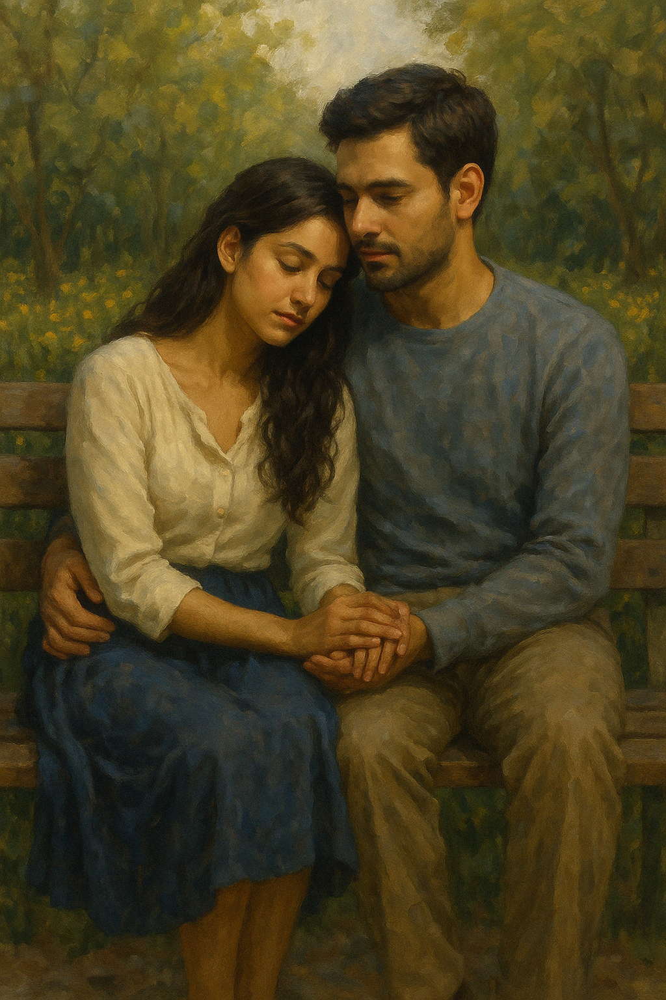

## Chapter 6: The Days That Feel Like Ours
*As If You Never Left*

The days passed not with urgency, but with a softness that surprised her.

Elara no longer moved like a guest in Mira's world. The apartment still didn’t feel like hers, but it didn’t reject her anymore. The silence had turned companionable, the objects in the home less foreign. She had stopped tiptoeing.

She cooked breakfast sometimes—simple meals, the way her mother had taught her. Raiyan would join her on occasion, arriving with flour on his sleeves or groceries tucked under one arm. He wasn’t always on time, but he always arrived.

They would talk about little things. Which herbs were taking root. Whether the laundry would dry by afternoon. What fruit was in season. Their conversations were unremarkable—and that was the point. In a story made of impossible beginnings and unspoken ends, these were the moments that tethered her.

One morning, they repotted basil together.

Raiyan’s hands were clumsy in the soil, but he smiled like a child. "I don’t remember you teaching me this."

"Maybe it’s new," Elara replied, brushing hair from her face. "Maybe we’re learning together."

He paused, then met her eyes with a kind of gentle weight. "I like that."

And she felt it again—that ache she never knew how to name. The one that lived between familiarity and fear.

These days felt like theirs. But she didn’t know if they were allowed to keep them.

Later that afternoon, they sat on the floor of the living room, surrounded by books and cushions. The window was open, letting in the soft lull of distant traffic and the rustling of leaves. Elara had brought out a stack of poetry books from Mira’s shelf, and Raiyan—despite his protests—had let her read aloud.

Her voice was unhurried, low, as if reading not to him but to the room, or to herself. Still, he watched her, the way her lips moved over words, the way her fingers absentmindedly traced the lines on the page.

"You always pause before the last stanza," he said.

She looked up. "Do I?"

He nodded. “You used to. And now you still do.”

Elara closed the book softly. "Some endings feel too heavy to rush."

He nodded, and then silence returned—but it was not empty. It was shared. Felt.

She leaned back against the couch, knees drawn up, the poetry book resting in her lap. "Sometimes I think poetry’s the only language that gets close to what we feel."

Raiyan smiled. "That, and silence."

They both laughed, quietly.

She looked at him then, really looked. At the softness that had returned to his face. The way the grief hadn’t vanished but had learned to sit beside him instead of pulling him under.

And she realized: these weren’t borrowed moments anymore.

They were being written—slowly, delicately—by the two of them.

In the weeks that followed, the softness deepened.

There was the afternoon they built a pillow fort in the living room after a storm knocked out the power. Raiyan lit a few tealight candles, and Elara read by their glow until both of them were laughing at the absurdity of how much they enjoyed it. She fell asleep in the makeshift fort, and when she woke, Raiyan was still beside her, sketching something in the margins of a newspaper.

There was the night he taught her how to make his mother’s chicken soup, only to burn the garlic and set off the smoke alarm. They had laughed until they cried, waving kitchen towels in the air and arguing over who was more to blame. Later, they ate toast and eggs on the floor because the stove needed airing out, and Elara couldn’t remember the last time she felt so full.

On a weekend, they took the train to the edge of the city just to buy fruit from a stall he remembered visiting as a child. She tried lychee for the first time and made a face so exaggerated that Raiyan nearly dropped the plastic bag from laughing. He bought her a second just to watch her try again.

And one late night, they sat on the balcony in silence, a blanket over their legs, heads tilted toward the stars. No grand declarations. Just the hush of night and the slow rhythm of breathing in sync.

These moments weren’t borrowed.

They were given.

And Elara, without knowing how, had begun to fall for a man who still believed she was someone else.

And yet, he had never made her feel more seen.

At night, when he had gone and the apartment settled into stillness, Elara would sit by the window with her journal, trying to understand the shape her heart had taken.

It wasn’t just grief anymore. It wasn’t even guilt.

It was longing—for something real, even if it could never last.

She no longer counted her days in fear. She marked them by the moments that made her feel alive. The way he laughed with his whole body. The way his eyes softened when she spoke without needing to say much at all. The way she started to remember her own name not as a shadow, but as a person with a life worth stepping into.

In the margins of her journal, she wrote:

*Day 41.*

*Sometimes I forget I’m supposed to leave.*

*And sometimes I look at him and think—maybe I was meant to arrive.*

---

Raiyan didn’t write his thoughts in a journal, but if he had, they might have read the same.

He lay awake some nights, listening to the rhythm of the rain or the fan ticking softly above. Sometimes he would replay the little things—how she tilted her head when she listened, how she hummed to herself without realizing, how her laughter had changed.

It wasn’t that she felt like a stranger.

It was that she felt like someone rediscovering the world, and letting him rediscover it with her.

She had always been kind. But now there was something else—something steadier. Her touch more deliberate. Her silences more thoughtful. He had known Mira through every chapter of their life together. But this version, this now… she was still Mira, and not. And he was slowly falling in love with her all over again.

It scared him, that truth.

Not because he didn’t want it—but because he didn’t know what it meant.

And yet, when she smiled at him, when she reached for his hand like it was the most natural thing in the world—he didn’t pull away.

He held on.

He began noticing things he hadn't before.

How she now took her coffee with a splash of oat milk, when Mira had always preferred it black. How she watched the rain like she was memorizing it. How her smile came slower, but stayed longer.

One evening, he caught her sketching in a notebook with a pencil he didn’t recognize. The drawing was of hands—his, hers—loosely interwoven, not holding but reaching. It felt intimate in a way words never quite captured.

He didn’t ask about it.

He didn’t want to break whatever spell they were living inside.

Some nights, when she laughed too freely or lingered a second too long with her fingers brushing his sleeve, he felt the question rise inside him: *Who are you becoming?*

But it always faded under the softer truth: *Whoever you are, I love you like this.*

---

Elara didn’t know what he saw in her eyes now—but she was beginning to see herself.

She sat with her sketchbook that same evening, legs curled under her on the couch. Her pencil hovered above the page, unsure of what to draw next. The interwoven hands had come to her without thought, but now—now her heart felt heavier with knowing.

It wasn’t just that she had fallen for Raiyan.

It was that he was unknowingly falling for her too. Not Mira. Not entirely.

Her.

And the guilt, the beauty, the ache of that truth pressed into her chest like breath she couldn’t release.

She closed the sketchbook gently.

Walked to the window.

Outside, the stars were faint tonight, veiled by the haze of the city. But she tilted her head up anyway, whispering a quiet plea—not to be forgiven. Not to be freed.

Just for time. A little more time.

To give. To be. To love.

And then, maybe, to let go.

---

The next evening, they sat on the rooftop of his building, the city stretched out in soft lights beneath them. A warm breeze carried the scent of grilled food and blooming frangipani from somewhere down the block. They sat close—not touching, but close enough to share warmth beneath the shared blanket draped over their knees.

Raiyan pointed toward the sky. "That one’s Vega. The brightest in the Lyra constellation."

Elara followed his finger, nodding. "It looks lonely."

"Maybe it’s just waiting."

She smiled at that. A wistful sort of smile.

Silence returned—not empty, but expectant.

She turned toward him, her voice low. "Raiyan... can I tell you something?"

He looked at her, eyes soft. "You can tell me anything."

She opened her mouth, but no words came.

What could she say? That she was someone else? That her time was running out? That every moment was a breath stolen from fate?

He waited, patient.

But her courage faltered.

She looked down. "I just... I’m really glad I’m here. With you."

He reached for her hand under the blanket and held it, gentle and steady.

"Me too," he said.

And though she hadn’t said what she meant to, he held her hand as though he already knew.

They sat like that for a long time, watching the stars begin to fade behind thin clouds. The city pulsed gently below them—alive, indifferent, unaware. But up here, it felt like time had stretched to cradle them gently in its hands.

Elara leaned her head against his shoulder, and Raiyan didn’t move.

“I think,” she whispered, “this is the happiest I’ve ever felt. And that scares me.”

Raiyan turned his face slightly, resting his cheek against her hair. “Why?”

“Because I don’t know how long I’m allowed to keep it.”

He didn’t press. Didn’t ask.

Instead, he whispered, “Then let’s not waste a second of it.”

And Elara closed her eyes, willing her heart to stay steady, even as it cracked open wider.

Above them, Vega disappeared into the night.

And below, the city lights flickered like borrowed stars—brief, beautiful, and burning.

---

She began to count the days again.

But not down, like a clock winding toward an end.

Up.

The rooftop near-confession had happened on Day 50. Since then, something inside her had shifted. She no longer measured time by distance from the past—but by how fully she could feel the present.

She marked each passing day in her journal, not with dread but reverence. Not one of them was taken for granted.

Day 51: *We stayed in. Raiyan brought home oranges and said I looked like I needed sunlight. We peeled them in silence. He gave me the sweetest slice.*

Day 53: *We danced in the kitchen. No music. Just laughter and bare feet on tile.*

Day 56: *He fell asleep on the couch, arm slung across his face. I sketched him in the quiet. He stirred, smiled in his sleep. I didn’t wake him.*

Day 58: *He told me I smelled like jasmine. I didn’t know what to say, so I changed the subject. But my heart wouldn’t stop racing.*

Day 60: *He looked at me like he was about to say something. I looked away before he could.*

Each entry was small. Fleeting. But it was the texture of her borrowed life.

Some mornings, she woke gripped by panic—knowing the clock was still ticking. That no matter how fully she lived in each moment, there would be a final one.

But by nightfall, with his hand brushing hers, or his laughter echoing off kitchen walls, she would remind herself:

*This is not forever.*

*But it is mine.*

She could feel herself unraveling into him a little more with every day.

It was in the way her eyes searched for him first when something funny happened. How her footsteps unconsciously slowed when she neared the corner where they first met again. How her body leaned toward his warmth before her mind even noticed. It was in the way she memorized the sound of his laugh, the slope of his shoulders when he read, the crinkle beside his eyes when he teased her.

Raiyan, too, had begun to shift—softly, surely. He reached for her hand without hesitation now. He lingered in doorways longer, his eyes trailing over her as though drinking her in for later. He asked questions he never used to ask. About her thoughts. Her dreams. Her silences.

He never once used the word 'love.'

But it bloomed between them in the way he brought her tea without asking how she liked it—and somehow always got it right. In the way he stood beside her while she watered the balcony herbs, as if his presence alone could help them grow.

They were falling. Not in bursts or declarations—but in steady, sacred ways.

And though the clock moved forward, Elara clung to every second not in desperation, but in devotion.

Each moment was a bead strung onto a fragile thread of light.

And she—quietly, achingly—loved him more with every one.

Some nights, she would wake before dawn and simply watch him breathe—his silhouette faint in the soft grey of morning, hair tousled, lips slightly parted. There was a reverence in how she studied him, as though her eyes were memorizing what her hands would one day have to let go of.

She began keeping two journals—one hidden, just for him.

In it, she wrote things she could never say aloud:

*Day 62: He told me he likes the way I’ve changed. I smiled, but my chest hurt so deeply I had to step outside and cry.*

*Day 65: He brushed a strand of hair behind my ear. I wanted to tell him I wasn’t her. But the way he looked at me—I wanted to be.*

*Day 68: I think I’ve stopped pretending. Not because I’ve forgotten Mira, but because I’ve started remembering myself.*

The journal filled slowly, tenderly, like a love letter written backward.

And with every page, Elara understood what the hundred days had become.

Not a chance to replace someone.

But a quiet permission—to feel everything, even if it could never be hers to keep.

---

**Day 99.**

The sky was overcast, soft with silver light. They spent the morning indoors, reading by the window, the sound of light rain filling the spaces between them. There was nothing grand about the day—no special occasion, no reason to celebrate.

But in the stillness of that afternoon, Raiyan turned to her.

She was curled up beside him on the couch, tracing the rim of her teacup. The journal was hidden away, her heartbeat loud beneath her ribs.

“Mira,” he said. But then he paused.

No—he didn’t say it like before.

He looked at her, deeper, as if trying to name something he couldn't explain. "You feel different. You've felt different for a while now. Not wrong. Not distant. Just... changed. And I keep telling myself it’s grief. Healing. Time."

She held her breath, heart thudding in her chest.

“I don’t know what it is,” he continued, voice quieter now. “I just know that every day, I see more of someone I didn’t know I could love. And I do. I love her. You.”

He reached for her hand, gently.

“I don’t need to understand everything. All I know is—I love who you are. Now. Today. Whatever shape your heart has taken.”

Tears welled in her eyes.

She didn’t speak. Couldn’t.

But she leaned forward and pressed her forehead to his.

And in that silence, Day 99 passed—not as a warning, but as a blessing.

A love, finally spoken.

On the edge of goodbye.

