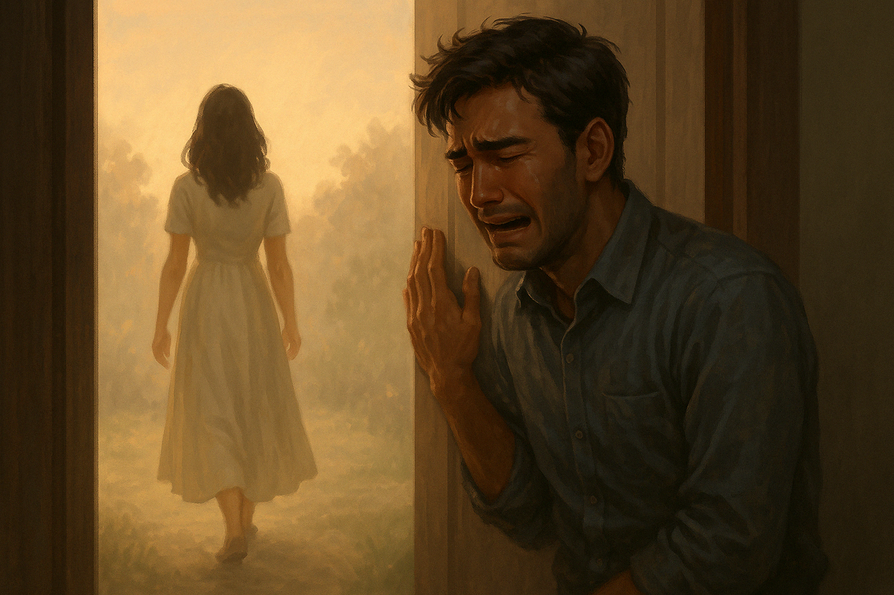

## Chapter 7: Day 100 – The Final Morning
*As If You Never Left*

The morning arrived with an unnatural stillness.

The kind of stillness that felt sacred, like the world had paused just long enough to take one last breath.

Elara woke before the sun, the sky outside still the color of soft ash. She lay on her side, watching the slow rise and fall of Raiyan’s chest beside her. His face, so familiar and beloved, was softened in sleep—his hand curled loosely against the pillow, his brow uncreased for once.

She reached out, brushed a thumb gently across his knuckles. Committed the warmth to memory.

She didn’t cry. Not yet.

She slipped quietly from the bed, her movements practiced now in silence. The floorboards didn’t creak. The morning light didn’t rush.

In the kitchen, she brewed tea just the way he liked it.

She didn’t know how long she had left—not minutes or hours, just the knowing that something was ending. That her borrowed time was nearly spent.

She sat with the tea and opened her second journal—the one she’d hidden beneath the loose floorboard near the window.

She turned to the final page.

*Day 100.*

*I love you.*

*That’s all.*

*That’s everything.*

She closed the journal and tied it with a ribbon—one of Mira’s, soft and pale blue. She placed it on the kitchen counter beside his mug, the steam curling up as if trying to hold onto the moment a little longer.

Then she moved through the apartment slowly, deliberately. She touched the bookshelf, ran her fingers along the frame of the wedding photo they never got to take. She straightened the cushions they had once buried themselves in during a pillow fort storm. She watered the herbs one last time.

On the balcony, the morning breeze wrapped around her like a shawl. The city was beginning to stir, but up here, time still moved differently. She watched the light shift across rooftops and thought of all the lives continuing beneath them.

Then she closed her eyes.

And in the darkness behind her lids, the days came back.

Day 1: Waking in the quiet of a world that was not hers, in a body stitched from memory. The mirror, the unfamiliar face. The name she didn’t know how to wear.

Day 4: Raiyan’s first gaze—hopeful, afraid. The tremble in his voice when he called her *Mira*. How she had nodded, though the name settled like borrowed light across her skin.

Day 7: The bookstore. His smile. Her silence. The ache that began then—quiet, curious, blooming.

Day 15: The night she wept under hot water, gripping the edge of the sink, mourning both the girl she once was and the one she was pretending to be.

Day 26: Grandmother Suraya’s visit. The trembling of Elara’s voice when she finally confessed. The quiet acceptance in the old woman’s eyes. The way her arms opened without hesitation, pulling Elara into something warm and human. The words she whispered—"You are not Mira. But you are someone just as precious."—etched into her like grace.

Day 29: Her fingers in the soil. The herbs beginning to breathe again. A little like her.

Day 34: The words almost spoken. The fear that swallowed them whole.

Day 41: Her voice reading poetry aloud while he listened with eyes closed, as though every word was something sacred.

Day 50: That rooftop. The weight of truth on her tongue. His hand beside hers, steady and warm.

Day 51 through 98: The brush of fingertips while washing dishes. The warmth of his shoulder against hers during train rides. His voice calling her name from another room—and the way it no longer hurt.

The way her laughter became her own.

The way her love did too.

Day 99: His eyes, filled with something deeper than memory. The way he held her face and said, "I love you."

And she believed him.

A hundred days, each one threading her closer to the life she never expected to find. From confusion to clarity. From guilt to grace. From loss to love.

And finally, with breath drawn full in her chest, she whispered—barely audible but deeply meant—not to no one, not just to herself, but to him, as though her soul reached for his:

"Thank you."

In the bedroom, Raiyan stirred.

The warmth beside him was gone.

At first, he wasn’t sure what had woken him—the faint change in air, the quiet. Then he heard it.

A whisper.

“Thank you.”

Not loud, not near. But close enough to curl into the hollow of his chest. As if she had leaned down and left the words on his skin.

His breath caught.

“Mira?”

He said it softly. A question, a hope, a wound reopening.

He sat up slowly, eyes scanning the room as the ache of knowing spread through his ribs.

The sheets were still warm.

The world too quiet.

He swung his legs over the side of the bed. Stood. Moved through the hallway as if in a dream.

In the kitchen, the mug still steamed. The ribboned journal rested beside it, waiting.

He didn’t touch it.

His gaze turned to the balcony.

And there—just for a heartbeat—he saw her.

A figure draped in morning light, hair stirred by the breeze, standing as if she belonged to it.

He stepped forward, faster now.

“Mira—”

But when he reached the door, there was only the light.

And the space where she had just been.

Not vanished. Not erased. But gone, as if the morning had closed its palms around her and kept her safe within its breath.

Raiyan stood there, hand still on the glass, breathing hard, searching the quiet skyline.

But there was only the breeze.

And the light that kept moving.

He opened the balcony door with trembling hands.

“Mira?” he called again—this time louder. “Mira!”

His voice cracked on the second cry, raw and hoarse.

He stepped outside, panic clawing its way up his throat. “Mira!”

The balcony was empty.

He looked over the railing, searching rooftops, the alley below, the morning sky—as if she might reappear if he just looked hard enough. He turned in circles, dizzy with desperation.

“MIRA!” he shouted, this time with all the air in his lungs.

Still, there was no answer. No trace. No sound but the wind.

His breath caught, stuttered. Then collapsed.

He stumbled back, his legs finally giving way beneath him. He fell hard onto the floorboards, hands clutching at his face, his chest. And he broke.

A sob erupted from deep within him—one that scraped his ribs, cracked open his throat. He cried like a man being undone, like something sacred had been torn from his arms.

He slammed his fist against the floor. Once. Twice.

"Why—why would you leave me again?" he choked. "Why would you come back just to go?"

There were no answers.

Only the soft shiver of the breeze through the balcony door, and the faint scent of lavender that lingered where she had stood.

He stayed like that—broken, breathless—until the storm inside him began to dull into tremors.

He wiped his face with shaking hands. Rose slowly. His limbs felt heavy, as though mourning had weight.

Then he saw it.

The journal. Still resting on the counter...

