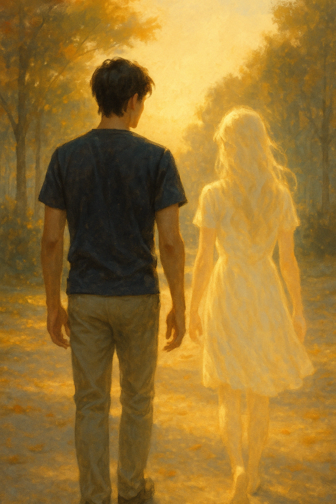

## Chapter 8: As If You Never Left
*As If You Never Left*

Raiyan stood in the middle of the kitchen, eyes locked on the ribboned journal.

His hands moved before his thoughts did. He reached for it—fingers trembling, breath still uneven. The ribbon came undone slowly, its softness a contrast to the heaviness in his chest.

He opened the cover.

The first page held her handwriting—delicate, certain.

*Day 1: I don’t know why I’m here. But I’ve been given a body that isn’t mine, a name that isn’t mine, and a man who looks at me with love I haven’t earned.*

His throat tightened. He flipped to the next page.

*Day 3: I tried to smile the way she did. He noticed it wasn’t the same. But he didn’t say anything.*

The entries were short. Sparse. But intimate in a way that cracked him open. Some pages held only single lines:

*Day 10: I didn’t think it was possible to grieve someone else’s life.*

*Day 18: He asked if I was alright. I wanted to say no. But she would’ve said yes.*

*Day 26: She told me I was not Mira. But still precious.*

*Day 41: He laughed today. Really laughed. I think I did too.*

As he turned each page, the truth unfolded—not as betrayal, but as grace. She hadn’t taken Mira’s place.

She had walked with her. And with him.

He reached the final entry.

*Day 100.*

*I love you.*

*That’s all.*

*That’s everything.*

The journal slipped slightly in his hands.

And he whispered her name for the first time.

"Elara."

As if speaking it made her real again.

As if she had never left.

He closed the journal slowly and held it against his chest, as if trying to cradle something fragile that had already slipped through his fingers.

She wasn’t Mira.

But she had loved him—as fully, as fiercely, as Mira ever had. Maybe even more so, because she had chosen to. Without history. Without memories. Just presence.

He stood there, unmoving, for a long while.

Then quietly, he walked.

Through the apartment, barefoot, slow. The same place he had lived in since before she died—yet everything felt altered now.

The mug on the counter, half-rinsed.

The folded blanket on the couch.

The pillow on the balcony chair where she liked to read in the morning.

Her touch was in everything.

Not just Mira’s. Hers.

He ran his fingers along the bookshelf, the spine of a poetry volume still marked with the dried petals she had placed there. He remembered her voice reading from it—not Mira’s tone, but one that had grown familiar, cherished.

A breath left his lips slowly, like grief exhaled.

She hadn’t come back to replace the past.

She had come to walk with him through the ache of it.

And now, she had gone. But she had left him softer.

He looked out the window, eyes glassed with memory.

And whispered again, more surely this time:

"Elara."

---

The world moved on.

Weeks passed.

The herbs on the balcony began to wilt in the first days after she left. Raiyan didn’t touch them. He couldn’t. But one morning, when the light hit the leaves just right, he noticed something new—green sprouting from the soil, quiet but persistent.

He began watering them again.

He didn’t try to recreate what they had. Instead, he revisited it gently—retracing the places she had brought back to life.

He walked past the bookstore where they first touched hands.

He returned to the park where she sat on the bench that first week, trying not to cry.

At home, he started writing letters to her in a small, leather-bound notebook. Not every day. Just when the ache grew too quiet to bear.

*I made your tea today. It tasted like something missing.*

*The lavender bloomed again.*

*I miss you in ways language hasn’t learned yet.*

He spoke to Grandmother Suraya one quiet Sunday. The sky was overcast, and the porch smelled faintly of rain and jasmine. They sat in two wicker chairs, hands wrapped around warm cups of tea. Birds danced across the railing, but neither of them was really watching.

“I knew,” Suraya said at last, her voice thin but sure. “Not everything. But enough to feel it in my bones.”

Raiyan looked down at his hands. “When did you know?”

“The second time I held her,” she said, a small, sad smile curling at her lips. “She was gentle. Familiar. But there was a weight behind her eyes that Mira never carried. I think love lets us see things others don’t.”

Raiyan nodded, but his throat tightened.

“I lost her twice,” he whispered. “Once in a blink. And once over a hundred days.”

Suraya reached over, placed her wrinkled hand over his.

“She didn’t come to stay,” she said softly. “But she came to give. And what she gave us was more than most people ever receive.”

He looked at her then, eyes rimmed with unshed tears. “Do you think Mira would hate me? For loving her again—someone else in her place?”

Suraya’s gaze didn’t waver. “No, anak. I think she would’ve held your hand through it. I think… that’s what she did.”

Raiyan closed his eyes for a moment, letting the quiet fill the spaces where words couldn’t reach.

“She called herself Elara,” he said, voice barely above a breath.

Suraya smiled, eyes glistening. “A beautiful name. For a beautiful soul.”

And they sat in silence, the wind gently stirring the trees, carrying the echo of those hundred days between them.

---

A few days later, Raiyan stood beneath a sky the color of unspoken things, holding a bouquet of marigolds and jasmine.

He made his way through the cemetery, the earth damp beneath his shoes, the world quieter than usual—as if it, too, remembered.

When he reached Mira’s grave, he knelt slowly.

The silence around him was heavy. Not empty—but filled with everything unsaid.

He stared at her name carved in stone, the letters sharp and final.

His voice broke as he began. “I don’t know how to begin. How do I explain falling in love with someone else, when it was still your body I kissed goodnight?”

He drew in a breath that trembled on its way out. “You left me. And I died with you. But then—then the world gave me someone back. Someone who looked like you, who sounded like you, who smiled like you used to… but wasn’t you.”

He paused, hand tightening around the stems of the flowers. “And I loved her.”

The admission came like a wound. Slow. Deep.

“I tried not to. I tried to stay loyal to your memory. But she wasn’t a ghost, Mira. She laughed. She argued. She made tea too strong. She reminded me how to live.”

He bowed his head, the tears falling freely now. “I hated myself for it. Every time she held my hand, I felt like I was betraying you. Every time I started to forget the sound of your voice… I felt like I didn’t deserve to heal.”

The marigolds trembled in his grasp.

“I’m sorry. I’m so sorry. For letting her in. For moving on. For loving her—not as a substitute, but for who she was.”

He looked up at the sky, voice cracking on the edge of his guilt. “But now I know... it wasn’t you I fell in love with again. It was her. Elara.”

He let out a shaking breath. “And that’s what hurts the most. That I didn’t even know. That I didn’t ask. That I just—believed. And yet... I still loved her.”

He closed his eyes. “I feel like I betrayed you. I thought I was loving you again. But it wasn’t. And now that I know... Mira, I don’t know how to carry that.”

The air shifted—subtle and slow. As if something unseen leaned in close.

And then it came. A weightless touch on his shoulder. Not imagined. Not dreamt. Just there.

As if she had laid her hand upon him one last time.

As if to say, *It’s alright.*

*It wasn’t your fault.*

*Thank you for loving her.*

Raiyan’s tears spilled freely.

He didn’t move. Didn’t speak.

He just stayed kneeling beside the grave, his heart cracked open in the quiet mercy of forgiveness.

And whispered, “Thank you.”

---

Later that afternoon, Raiyan found himself in a quieter part of town, a humble columbarium tucked away behind a temple courtyard.

The sky had turned gold by the time he arrived. He carried no flowers this time—just the journal, now wrapped again in its blue ribbon.

He stood in front of the niche where Elara’s ashes were kept. Her name engraved into the brass plate, simple. No dates. No epitaph. Just a name she had only barely gotten to own.

He touched the surface gently.

“Elara,” he said, the word full now, weighted with everything he could never say before.

“I don’t know if you knew what you did to me. What you gave me. You made me remember what it felt like to breathe again. To laugh. To want.”

His voice wavered. “You didn’t try to become her. But you taught me how to let her go without forgetting her. You gave me more than healing—you gave me hope.”

The journal trembled in his hands.

“I miss you,” he said quietly. “I miss your way of seeing the world. The way you listened. The way you loved like you had nothing to lose—because you knew you would.”

He rested the journal just beneath her name.

“I hope you knew,” he whispered. “I hope you knew you were loved. That I loved you.”

A breeze moved through the courtyard then—soft, warm, wrapping around him like a breath from somewhere unseen.

Raiyan smiled through his tears.

“Thank you,” he said. “For every single day.”

He sat down on the stone bench across from her niche, elbows resting on his knees, hands clasped tight. The sun was dipping low now, casting long shadows through the courtyard.

“I wish we had more time,” he said softly. “A hundred days felt like forever until it wasn’t. And now I find myself looking for you everywhere—in every quiet, every corner of the day.”

He swallowed hard, staring at the brass plate. “Sometimes I wonder if you ever wanted to stay. If there were nights you looked at me and felt the weight of goodbye pressing against your ribs.”

A pause.

“I want you to know... you changed me. Not with grand gestures. Just with the way you stood beside me. The way you listened without needing to fix me. The way you held space for my grief without asking me to let go of it too soon.”

His voice cracked again. “And even though I never got to say it properly, I love you. I loved you not because you reminded me of Mira. But because you taught me how to love again—differently. Freely. Quietly.”

The breeze stirred again, gentler now. It ruffled his hair, curled around his wrist, brushed against his cheek like a whisper.

Raiyan tilted his head back, eyes misted with peace and ache.

“I hope you knew,” he said again. “That it was real. That you were real.”

And as the wind slipped away into the golden quiet, he stood, touched the niche once more.

“Goodbye, Elara,” he said. “But only in words.”

He turned slowly from the niche, the blue-ribboned journal still resting beneath her name, and stepped into the fading light of the courtyard.

The breeze followed him gently, threading through the trees like fingers brushing past leaves, like memory refusing to vanish.

As he reached the gate, he paused one last time, hand on the latch.

Behind him, the shadows stretched long, golden and quiet.

And in that stillness, with the sun dipping low and the wind whispering past his ear, he could almost believe—

as if she had never left.

---

**Author's Note:**
This story concludes with **Chapter 8**, but readers may continue into one of two alternate epilogues (No Spoilers):

- **Epilogue A – A Door Reopened** 
- **Epilogue B – The Last Echoes** 

Choose the path that speaks to your heart.

