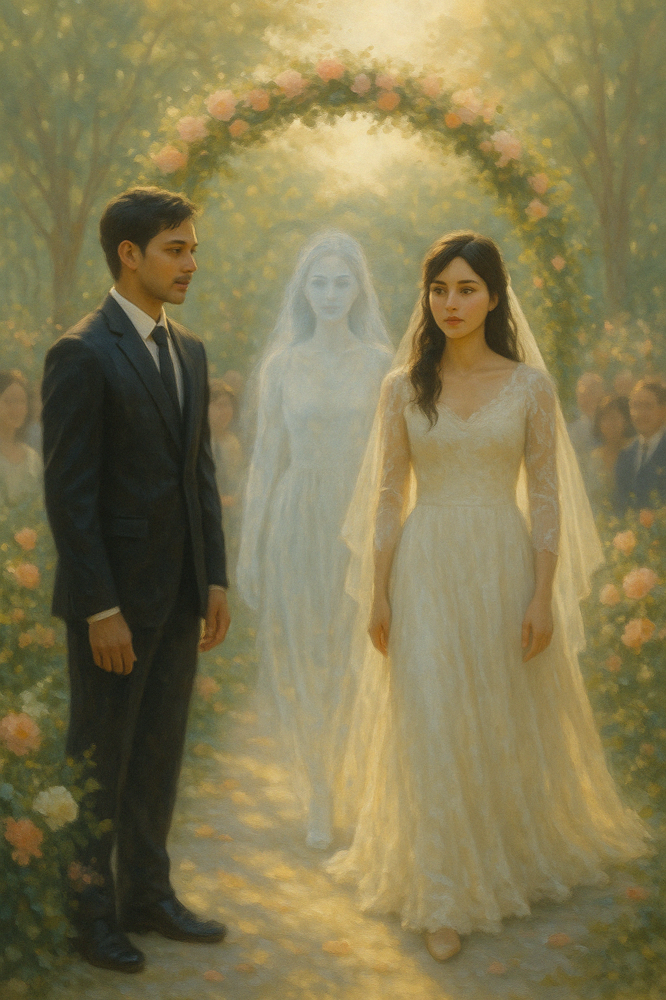

## Epilogue A: A Door Reopened

The morning light poured softly through the curtains, golden and still. Raiyan stood in the quiet hush of the apartment, dust dancing in the air as he opened the wardrobe.

He hadn’t touched the wedding dress in years. It hung in the far corner, shrouded in a faded garment bag, untouched but never forgotten. Gently, he unzipped it.

The fabric was still beautiful—soft ivory lace with delicate embroidery. He traced the bodice with reverent fingers. He remembered the day Mira first tried it on, laughter spilling from her lips. And he remembered the night Elara wore it, barefoot in the living room, weeping in a dance never meant to be.

He pulled the dress from the wardrobe and hung it near the window, letting the light catch in its folds.

“I loved you both,” he whispered. “In different ways. But completely.”

He sat down, letting the silence speak back. He had made peace. He had grieved and healed and loved and lost and lived.

A knock interrupted the quiet.

He stood, heart pausing. No one visited unannounced.

Another knock—soft, urgent.

He opened the door.

A woman stood there. Her hair loose, her eyes bright, her smile immediate.

She stepped forward and hugged him without hesitation.

And for a moment, Raiyan froze.

Her arms circled his back, firm but trembling. Her head nestled against his shoulder, as though she'd been waiting lifetimes just to rest there again.

And then—

His arms lifted. Slowly, hesitantly, then all at once.

He held her.

Not lightly. Not politely.

But completely.

He buried his face in her hair. It didn’t smell the same—not lavender and mint this time, but something warmer, unfamiliar. And yet it made his heart twist in recognition.

Her frame was different. Her voice had not yet spoken. But the way she clung to him—the way she melted into his chest like she had always belonged there—he knew.

His breath caught. His throat tightened.

And still he didn’t let go.

He didn’t need her to explain.

He didn’t need proof.

She was here.

She was real.

And when she finally pulled back, just far enough to look into his face, the tears welled in his eyes.

“Elara…” he breathed, the name falling from him like prayer.

Her lips trembled into a smile. “Hi.”

She pulled back just enough to look at him, eyes glistening.

He stared, too stunned for words. She was not in Mira’s body. She was herself.

Whole. Real.

“Mira sent me,” she said softly.

And then, slowly, she told him everything.

---

They sat across from each other on the living room floor, the wedding dress still hanging in the golden light behind them.

Elara’s voice was soft, uncertain at first, as though speaking the memories aloud might cause them to slip away.

“After Day 100,” she began, “I didn’t wake up in a bed or a body. I woke up somewhere I can’t quite explain. It was... warm. Soft. Like time didn’t exist there.”

Her fingers fidgeted with the hem of her sleeve. “And she was there. Mira.”

Raiyan’s breath stilled.

“She didn’t speak at first,” Elara continued. “Just smiled. Sat beside me. It wasn’t awkward or strange. It felt like... sitting with an old friend.”

She paused. Her eyes misted.

“I was afraid to look at her. Afraid she’d be angry. That I had taken something that belonged to her.”

Raiyan reached out, took her hand gently. She didn’t stop.

“But when I finally looked at her, she only said one thing: ‘I’m glad it was you.’”

Elara’s voice cracked. “She said she couldn’t have chosen anyone better to take care of you.”

She looked down at their joined hands. “I asked her if she hated me. If she thought I stole you. But she just laughed—quietly. Kindly. She said, ‘You didn’t steal anything. He just found love again in a new shape.’”

Raiyan felt his heart swell and ache all at once.

“She told me my time wasn’t done,” Elara whispered. “That this wasn’t my ending. And then... she pushed me. Not forcefully. Just gently—like a nudge. And the next thing I knew\... I was waking up in a hospital bed.”

She exhaled slowly, her gaze drifting to the window as if remembering how the light looked that day.

“There were machines. Beeping. Tubes. I couldn’t move at first. My body felt like it had been asleep for years. Because... it had.”

Raiyan listened, silent, reverent.

“They told me I’d been in a coma. An accident. My family thought they’d lost me.” She smiled faintly, bittersweet. “They were overjoyed when I woke up. But I... I didn’t know how to tell them that I hadn’t really been gone. That I had lived a whole other life in a hundred days.”

She paused. “My mother cried when I remembered her name. But I remembered yours first.”

Raiyan’s chest tightened.

“And then there was him. The man I was with before everything.”

She looked down, voice softer. “We tried. I owed him that. But I was different. And I think he knew.”

She met Raiyan’s eyes. “I told him the truth. Or at least... my truth. That someone else had helped me remember what it meant to love freely. That I had left too much of myself somewhere else.”

“And after we said goodbye, I knew I had to find you. Not because I was running from something—but because I was running toward the only place that ever felt like home.

Raiyan’s eyes shimmered, the weight of her words sinking deeper than any silence they had shared.

He moved beside her now, no longer separated by distance or disbelief.

Their hands met again, fingers twining slowly, tenderly, as if relearning the shape of something they never thought they'd hold again.

No one spoke.

There was nothing more to prove.

Just the soft cadence of two heartbeats finding rhythm in the same room.

He brought her hand to his chest, where the ache had once lived.

“Stay,” he whispered.

Her voice was barely audible. “Always.”

The dress still swayed gently near the window, its fabric glowing in the late afternoon light. It had been meant for a wedding that never came.

And yet, in that quiet moment, with no vows, no ceremony, no witnesses—

Something holy passed between them.

Not a beginning.

Not a return.

Just two lives converging again.

As if she had never left.

---

A few weeks later, Elara sat on the balcony of the apartment, sharing tea with Grandmother Suraya. The older woman’s eyes never left her as Elara recounted her story in pieces—hesitantly at first, then with more certainty, like petals unfurling in the light.

“And she was there,” Elara said softly. “Mira. She forgave me before I could even ask.”

Suraya nodded, her fingers wrapped around a worn ceramic cup. “I knew she would,” she said. “She always had a soft spot for love, even when it came in unexpected forms.”

Elara smiled, eyes shining. “She told me to come back. That it wasn’t my ending.”

“She was right,” Suraya said gently. “You still have something here. And someone.”

—

A few months later, Raiyan stood in the living room again, heart pounding in his chest.

Elara stood before him, breathless, her hair catching the sunlight.

He knelt—no fanfare, no crowd.

Just him, her, and the same quiet space where love had once returned like a whisper.

“Will you stay?” he asked, voice low, steady. “Not for a hundred days. But for every day after?”

Tears filled her eyes as she nodded. “Yes. For every day after.”

—

On their wedding day, the sky was clear, and the world held its breath.

Raiyan stood at the altar, heart calm, gaze steady.

And when Elara stepped into the aisle, dressed in the same gown once worn in grief, now radiant in joy—

For the briefest moment, Raiyan saw her.

Mira.

Walking beside Elara.

Not as a ghost, not as sorrow.

But as memory, grace, and blessing.

And he understood.

That some loves return to say goodbye.

And some—

some stay to begin again.”

