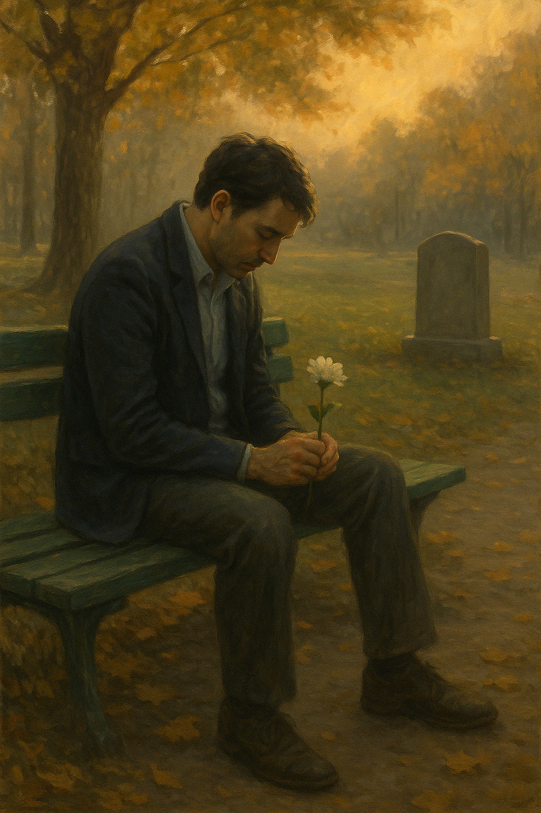

## Epilogue B: The Last Echoes

Years passed, as they always do.

Time did not rush him. It unspooled slowly, gently, like a thread pulled through silk. Raiyan aged with it—not untouched, but unbroken.

The apartment remained. The walls, once echoing with grief, had grown quiet and warm. He had changed little in it. The wedding dress still hung in the wardrobe, still folded with care. The balcony herbs—lavender, rosemary, mint—still flourished under his tending, though they belonged more to memory than necessity.

Sometimes, he stood there with a cup of tea and watched the sky shift. In spring, the wind smelled like her again.

Not all days ached. But some did.

He had learned to let them.

The grief no longer thundered. It moved like water now—calm, reflective. It visited him in quiet ways: the clink of porcelain, the crinkle of pages, the warmth of late afternoon sun.

He often walked to the park—the same one where Elara had once sat trying not to cry, the same one Mira used to bring a sketchpad to on lazy Sundays.

The trees had grown taller. The benches replaced.

But the golden hour? That never changed.

On one such day, he sat by the fountain with a small leather-bound notebook in his lap. The same one he had used to write to Elara after she was gone. He didn’t write every day anymore—only when something inside him stirred enough to speak.

*Today I heard someone laugh the way you used to. Not exactly. But enough to make me stop walking.*

*There’s a florist two streets down. She ties the ribbons the same way you did. Pale blue. Always pale blue.*

*I still remember the sound of your goodbye. It was softer than your hello.*

He didn’t cry anymore. Not really. But his eyes often misted in the way old windows do—when warmed by memory.

He closed the book and leaned back on the bench, the wood cool beneath his palms. The sky was beginning to shift—gold edging into rose.

He didn’t expect signs.

He didn’t wait for magic.

But sometimes, in the hush between bird calls and breeze, he felt her. Not near. Not gone. Just... *with*.

Legacy, he realized, wasn’t always a story passed down.

Sometimes it was the way someone folded their hands when they listened. Or how they brewed tea for someone grieving.

Sometimes it was a tune hummed by someone who never knew you—but somehow remembered.

He rose slowly from the bench, bones quieter than they used to be.

The sun dipped behind the trees as he walked home, each step steady, the evening stretching out around him.

The wind followed—soft and familiar.

And the last echoes of her love followed, too—

Not loud.

But lasting.

